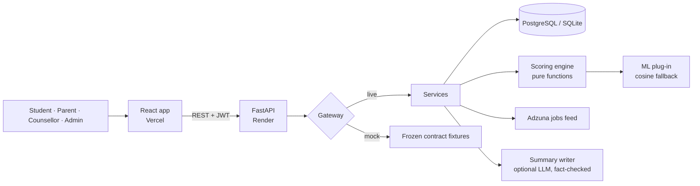

<div align="center">

# PRISM

**See every path. Choose yours together.**

A career-guidance platform for Indian students and their families: it weighs a student's strengths, what the family
can afford and what the job market pays, and shows **why** each career is suggested.

Built for **DataQuest 3.0** · Multi-Dimensional STEAM Career Guidance & Hyper-Local Innovation

**[Live demo](https://YOUR-VERCEL-LINK.vercel.app)** · [API docs](https://dataquest-wxr4.onrender.com/docs) · [How to judge it in 5 minutes](#judging-in-five-minutes)

</div>

---

## The problem

Most Class 10–12 students in India choose a career from three inputs: marks, what relatives say, and what the
neighbour's child did. Aptitude tests stop at "you are suited to engineering". They ignore the questions families
actually argue about at the dinner table:

- *Can we afford it, and will the loan be repaid?*
- *Will there be jobs in four years, and near home?*
- *Why does my child want design when we want medicine?*

## What PRISM does

PRISM turns a 74-question assessment into a **ranked, explained shortlist** of careers, colleges and funding
plans, built for the student **and** the parent.

| | |
|---|---|
| **Six-part score** | Every career is scored on fit, job market, affordability, return on investment, family agreement and automation risk. Each part is visible on a colour-coded bar. Nothing is a black box. |
| **The family, built in** | Parents join with an invite code, enter the budget and their hopes, and see a *conflict index* showing exactly where they and their child disagree, plus a guided family meeting to resolve it. |
| **Money made concrete** | Fees per quota, scholarships the student is eligible for, education-loan EMIs against family income, and a 10-year ROI against starting work after Class 12. |
| **What-if** | Change savings, move cities, or reweight priorities and watch the list re-rank instantly. |
| **A plan, not just a list** | Entrance exams, registration deadlines (announced / tentative / estimated), free courses (SWAYAM, NPTEL, DIKSHA) and a 5-year roadmap, with a calendar export. |
| **Honest data** | Every figure carries its source and a *Checked* or *Estimate* badge. Confidence ranges shrink when inputs are verified and widen when they are guessed. |
| **School counsellor view** | One counsellor can supervise hundreds of students and see who needs a human conversation: high family conflict, loan dependence, missed steps. |
| **Privacy by design** | Parental consent for under-18s, family money hidden from the student unless shared, and no caste or category data ever collected. |

## Judging in five minutes

Open the **[live demo](https://YOUR-VERCEL-LINK.vercel.app)** and sign in. All demo accounts use the password
**`Prism@Demo2026`**.

| Role | Email | Look at |
|---|---|---|
| Student | `creative_risk_averse.student@prism.example` | Home journey → Results → What-if |
| Parent | `creative_risk_averse.parent@prism.example` | Family → Budget → Family meeting → Plan |
| Counsellor | `counsellor@prism.example` | Counsellor dashboard (5 linked students) |
| Admin | `admin@prism.example` | Analytics, outcomes, data refresh |

Five families, each showing a different real-world situation:

| Student | Situation | What PRISM shows |
|---|---|---|
| Ananya | Creative, cautious family | A design career that still feels safe to her parents |
| Karthik | Top scores, low income | Scholarships and fee quotas that make a strong path affordable |
| Meena | Rural, loves building things | Local innovation opportunities near home |
| Rahul | Family relies on a loan | EMI strain against income, and lower-debt alternatives |
| Sara | Family already agrees | A clean, fast path with little conflict |

Swap `creative_risk_averse` in the email for `high_aptitude_low_budget`, `rural_steam_innovator`,
`loan_dependent_family` or `aligned_family` to sign in as the others.

> The backend runs on Render's free tier and sleeps when idle. The first request can take up to a minute; after that
> it is fast.

## How the score works

```
final = 0.30·fit + 0.15·market + 0.20·affordability + 0.15·ROI + 0.15·family − 0.05·automation risk
```

| Part | Built from |
|---|---|
| **Fit** | 19 measured dimensions (RIASEC interests, four aptitudes, thinking style, values, grit, risk tolerance) compared to each career's profile; blended with an optional ML model |
| **Market** | Salary bands and live job-posting counts by region (Adzuna feed, with offline import) |
| **Affordability** | Total cost after eligible scholarships, against a family's realistic education share and loan EMI comfort |
| **ROI** | Discounted 10-year earnings minus cost, against the baseline of working after Class 12; selective post-degree exams weight expected earnings by the real chance of clearing them |
| **Family** | Conflict index across six areas: field preference, risk, distance from home, budget, time to earn, prestige vs stability |
| **Automation risk** | How exposed the career is to automation; the only part that subtracts |

The ranking is **deterministic and reproducible**: every run stores the dataset version and weights it used, and
old runs are flagged when data changes. A 64-scenario sensitivity test reports how stable each rank is. A language
model may rephrase the summary, but it **never scores**, and any answer containing a number not in the facts is
rejected.

## Architecture



| Layer | Stack |
|---|---|
| Frontend | React 18, TypeScript, Vite, Tailwind, TanStack Query, Motion, Radix UI |
| Backend | FastAPI, Pydantic v2, SQLAlchemy 2, Alembic, JWT with refresh tokens |
| Engine | Pure Python functions; no I/O, fully unit-tested |
| Data | 51 careers · 101 pathways · 41 institutions · 42 scholarships · 33 exams · 20 local opportunities · 21 regions |
| Quality | 120 backend tests (engine, fairness, contracts, data truth, psychometrics) · frozen OpenAPI contract |
| Hosting | Vercel (frontend) · Render (backend) |

## Run it locally

**Backend**

```bash
cd backend
pip install -e ".[dev]"
python scripts/seed.py --demo --reset          # database + catalogue + 5 demo families
MOCK_MODE=false DEMO_MODE=true uvicorn app.main:app --port 8000
```

**Frontend** (second terminal)

```bash
cd frontend
npm install
npm run dev                                    # http://localhost:5173
```

Tests: `cd backend && pytest` · `cd frontend && npm test`

## Repository map

```
backend/    FastAPI service, scoring engine, seed data, migrations, tests
frontend/   React app (one file per screen in src/pages)
docs/       design notes, linked below
```

| Document | Covers |
|---|---|
| [ARCHITECTURE](docs/ARCHITECTURE.md) | Layering, mock vs live mode, the 19-dimension vector |
| [QUESTIONNAIRE](docs/QUESTIONNAIRE.md) | The 74 items, scoring, quality checks, pilot plan |
| [DATA_TRUTH](docs/DATA_TRUTH.md) | Where every figure comes from and how it is checked |
| [REAL_WORLD](docs/REAL_WORLD.md) | Reminders, reports, counsellor view, outcomes, fairness, loans, mentors |
| [API_CONTRACT](docs/API_CONTRACT.md) | Every endpoint, with examples and the privacy matrix |
| [ER_DIAGRAM](docs/ER_DIAGRAM.md) | Database design |
| [DEMO_PLAN](docs/DEMO_PLAN.md) | Demo script, fail-safes, judge Q&A |

## Limits we are honest about

- Some figures are still estimates; they are labelled as such in the app, and `scripts/data_audit.py` lists them.
- Real SMS and WhatsApp reminders need a Twilio account and DLT registration; calendar export works today.
- The questionnaire has not yet been validated with a large student pilot; the analysis tooling for one is ready.

<div align="center">
<sub>PRISM · DataQuest 3.0</sub>
</div>
