# PRISM Engine — Entity-Relationship Diagram (rev 3)

Target: PostgreSQL 15+. SQLite is a local-dev fallback only: no JSONB, no triggers, no materialized
view, no partial unique indexes on older versions. The Phase 1 tests run the integrity checks against
Postgres (docker) so the guarantees below are actually exercised.

## Conventions (every table unless noted)

- `id uuid PK` generated in Python (`uuid4`), so SQLite works too.
- `created_at timestamptz NOT NULL DEFAULT now()`, `updated_at timestamptz NOT NULL` (ORM-maintained).
  All timestamps UTC; date-only deadlines are interpreted in `Asia/Kolkata`.
- Money: `bigint` whole rupees, `CHECK (>= 0)`. Shares and probabilities: `numeric(4,3) CHECK (0..1)`.
- Soft delete (`deleted_at`) on user-owned and catalog rows. Catalog rows are never hard-deleted while an
  analysis run references them (FKs from outputs are `RESTRICT`).
- Provenance on every market/salary/cost/scholarship/local-opportunity row: `source_name NOT NULL`,
  `source_url NULL` (only real URLs, `CHECK (source_url ~ '^https://')`), `as_of date NOT NULL`,
  `confidence CHECK (0..1)`, `is_estimate bool NOT NULL DEFAULT true`, `dataset_version_id FK`,
  `verification text CHECK IN (unverified, secondary, verified, disputed)`, `verified_on date`, `evidence text`,
  with `CHECK (is_estimate OR (verification IN ('verified','secondary') AND evidence IS NOT NULL AND verified_on IS NOT NULL))`,
  `CHECK (verification <> 'verified' OR source_url IS NOT NULL)` and
  `CHECK (verification <> 'disputed' OR is_estimate)`. See `DATA_TRUTH.md`.
- Enumerations are `text` + `CHECK (col IN (...))` (portable to SQLite, easy to migrate).

## Loopholes found in rev 1 and how rev 2 closes them

| # | Loophole in rev 1 | Failure it causes | Fix in rev 2 |
|---|---|---|---|
| 1 | Catalog rows (signals, salaries, fees, scholarships) are updated in place by a refresh | An old run can no longer be reproduced, which breaks the reproducibility promise | New `dataset_versions` table. A refresh creates a new version, and catalog rows carry `dataset_version_id`. Each run stores the `dataset_version_id` it used, plus the exact numbers in `input_snapshot` |
| 2 | "Immutable" outputs were only a convention | A bug or manual SQL silently rewrites history | Postgres trigger `forbid_update_delete()` on `analysis_runs`, `recommendations`, `recommendation_breakdowns`, `conflict_reports`, `what_if_runs`, `scoring_configs` (once used) and `audit_logs` |
| 3 | `analysis_runs.student_id ON DELETE RESTRICT` | A family cannot delete their data, which violates the right to erasure under India's DPDP Act 2023 | Erasure job: soft delete, then a hard delete after 30 days that cascades to runs. Admin analytics come from a k-anonymised materialized view, so erasure doesn't distort old aggregates more than necessary. The erasure itself is recorded in `audit_logs` with the subject id hashed |
| 4 | `student_profiles.family_id` duplicated membership already held in `family_links` | The two sources disagree, and a student shows in two families | Dropped `student_profiles.family_id`. Membership lives only in `family_links`, with a partial unique index so each student has at most one active family |
| 5 | `consent_records` allowed any number of overlapping rows, and `granted_by` was unchecked | Contradictory consent state; a minor could grant their own consent | Consent rows are an append-only event log, and the current state is the latest row per (subject, type). `granted_by_link_id FK family_links` proves a guardian relationship. A minor's `minor_data_processing` consent must come from a parent or guardian link (CHECK plus service rule) |
| 6 | `trait_scores` had UK(student, dimension) **and** a FK to the submission | Retaking a test either fails or erases history | UK(submission_id, dimension). The latest vector is read through an index on (student_id, dimension, created_at desc) |
| 7 | `responses` had no uniqueness and no guarantee the question belongs to the instrument | Duplicate answers inflate scores; answers to another test's questions slip in | UK(submission_id, question_id) plus **composite FKs**: `(submission_id, instrument_id) → assessment_submissions(id, instrument_id)` and `(question_id, instrument_id) → questions(id, instrument_id)` |
| 8 | Questions were editable after students answered them | Old answers change meaning | `assessment_instruments.published_at`. Once published, questions are frozen by a trigger; a change means a new instrument version |
| 9 | `family_invites.code` stored in plain text; `uses` incremented without a guard | Leaked codes from a DB dump; a race allows extra joins | Store `code_hash` (sha256). Join uses an atomic `UPDATE … SET uses = uses + 1 WHERE uses < max_uses AND expires_at > now() RETURNING`, plus `CHECK (uses <= max_uses)` |
| 10 | No login throttling and no refresh-token reuse detection | Brute force; a stolen refresh token lives forever | `users.failed_logins`, `locked_until`. `refresh_tokens.token_family`: reusing a rotated token revokes the whole family |
| 11 | No link between educators and students | Any educator could read any student | `educator_assignments` (educator, student, consent_record_id) is required for educator reads |
| 12 | `career_edges` had no uniqueness | Duplicate edges skew "hidden gem" scores | UK(from_career_id, to_career_id), `CHECK (from <> to)`. Overlap is stored once per direction because transition difficulty is directional |
| 13 | `salary_bands.region_multiplier` stored on rows that are already regional | The region effect gets applied twice | Rows are either national (`region_id NULL`) or regional. `regions.salary_multiplier` applies **only** when falling back from national. UK(career, region, level, percentile, dataset_version) |
| 14 | One fee per pathway, with no quota and no fee year | Government vs management MBBS fees (₹20k vs ₹18 L) collapse into one number; inflation counts from the wrong year | `pathway_fees` (pathway, quota ∈ {government, management, nri, open}, fee_academic_year, tuition, hostel, living, misc). Inflation starts from `fee_academic_year`. Quota is **not** caste or category |
| 15 | Exams had a single `next_window` | Two-session exams (JEE Main) and next year's cycle can't be represented; the roadmap runs out of dates | `exam_sessions` (exam, cycle_year, session_no, registration_open, registration_close, exam_start, exam_end, is_estimate) |
| 16 | Scholarships: amounts only fixed; only a `stackable` flag; free-form JSON rules | Percentage waivers can't be modelled; two mutually exclusive government schemes get stacked; malformed rules crash the solver | `amount_type ∈ {fixed, percent_tuition, full_tuition}`, `amount_value`, `annual_cap`. `exclusive_group` (at most one per group is a knapsack constraint). `rules_schema_version`, rules validated by Pydantic at ETL, and `CHECK (jsonb_typeof(eligibility_rules) = 'object')` |
| 17 | `regions.pincode_prefixes` array | Prefixes overlap, so a pincode maps to the wrong district and local opportunities miss | `pincode_regions` (pincode PK, district, region_id). Local opportunities link to districts through it |
| 18 | `what_if_runs` repeated `analysis_runs.parent_run_id` | Baseline ids can disagree | `what_if_runs.result_run_id` is UK, and the composite FK `(result_run_id, baseline_run_id) → analysis_runs(id, parent_run_id)` forces agreement |
| 19 | `recommendations.pathway_id ON DELETE SET NULL` | A run loses which pathway it costed | `RESTRICT` (catalog is soft-deleted, so this never blocks normal operations) |
| 20 | `parent_career_preferences.domain` unconstrained | Typos ("Engg") never match careers, so the conflict index is wrong | `CHECK (domain IN (12 domains))` plus `CHECK (num_nonnulls(career_id, domain) = 1)` |
| 21 | Finance coherence checked only in the API | A seed or ETL insert can create a family whose EMI exceeds income | DB CHECK: `annual_income IS NULL OR max_affordable_emi + existing_debt_emi <= annual_income / 12`. `family_finance` is versioned (UK(family_id, version), one `is_current`) so every run points at the exact version it used |
| 22 | Two parents can each hold preferences, but the engine contract didn't say how to combine them | The conflict index picks one parent at random | Documented rule: parents' ranked lists are merged with a Borda count. `conflict_reports.parent_inputs` stores which parents contributed |

## Rev 3 additions (data truth, real-time feed, questionnaire)

| Change | Why |
|---|---|
| Verification columns on every provenance-carrying table (above) | A figure can't be stored as fact without a check, evidence and a date |
| `posting_snapshots` (career_id, region_id, fetched_on, posting_count, mean_salary, query) UK(career, region, fetched_on) | Raw daily counts from the Adzuna feed; demand and 30-day velocity are derived from them, so a signal can always be traced back to its counts |
| `exam_sessions.registration_status`, `exam_date_status` ∈ {announced, tentative, estimated} | NTA's calendar dates are tentative; registration dates often aren't announced yet. One "is_estimate" flag hid that difference |
| `scholarships.year_amounts int[]`, `deadline_status` | Some schemes pay different amounts by year (Central Sector: ₹12k years 1–3, ₹20k years 4–5); last year's deadline isn't this year's |
| `careers.search_keywords` | Keywords the postings feed uses per career |
| `trait_norms` (instrument_id, dimension, grade_band, n, quantiles jsonb) UK(instrument, dimension, grade_band) | Percentiles are computed only from a real norm group with n ≥ 200 |
| `assessment_submissions.flags` values: straight_lining, speeding, contradictory_answers:<trait>, incomplete | Quality flags travel with the scores and reduce reliability |

## Diagram

```mermaid
erDiagram
    %% ───────────── Identity & access ─────────────
    users {
        uuid id PK
        text email UK "lower(email), unique where deleted_at is null"
        text password_hash "argon2id"
        text full_name
        text role "student,parent,educator,admin"
        date date_of_birth "students: required"
        int failed_logins
        timestamptz locked_until
        timestamptz deleted_at
    }
    refresh_tokens {
        uuid id PK
        uuid user_id FK "CASCADE"
        uuid token_family "reuse revokes the family"
        text token_hash UK
        timestamptz expires_at
        timestamptz revoked_at
    }
    families {
        uuid id PK
        text name
        uuid created_by FK "SET NULL"
        timestamptz deleted_at
    }
    family_links {
        uuid id PK
        uuid family_id FK "CASCADE"
        uuid user_id FK "CASCADE"
        text member_role "student,parent,guardian"
        text relation
        text status "active,removed"
    }
    family_invites {
        uuid id PK
        uuid family_id FK "CASCADE"
        text code_hash UK "sha256"
        int max_uses "CHECK uses <= max_uses"
        int uses
        timestamptz expires_at
    }
    consent_records {
        uuid id PK
        uuid subject_user_id FK "CASCADE"
        uuid granted_by FK "RESTRICT"
        uuid granted_by_link_id FK "family_links; guardian proof"
        text consent_type
        bool granted "append-only events"
        text policy_version
    }
    educator_assignments {
        uuid id PK
        uuid educator_user_id FK "CASCADE"
        uuid student_user_id FK "CASCADE"
        uuid consent_record_id FK "RESTRICT"
        timestamptz revoked_at
    }
    audit_logs {
        uuid id PK
        uuid actor_user_id FK "SET NULL"
        text action
        text entity_type
        uuid entity_id
        text request_id
        jsonb diff "redacted"
    }

    %% ───────────── Student & family inputs ─────────────
    student_profiles {
        uuid id PK
        uuid user_id FK,UK "CASCADE"
        int grade "8..13"
        text board
        text stream
        char6 pincode FK "pincode_regions"
        numeric recent_score_pct "0..100"
        numeric willing_to_relocate "0..1"
        numeric willing_abroad "0..1"
        timestamptz deleted_at
    }
    family_finance {
        uuid id PK
        uuid family_id FK "CASCADE"
        int version "UK(family_id, version)"
        bool is_current "partial UK"
        uuid updated_by FK
        text income_band
        bigint annual_income "CHECK emi + debt <= income/12"
        bigint allocatable_savings
        bigint existing_debt_emi
        bigint max_affordable_emi
        int dependents
        numeric loan_tolerance
        numeric risk_appetite
        numeric relocation_willingness
        numeric abroad_willingness
        int time_to_earn_years
        text prestige_vs_stability
    }
    parent_career_preferences {
        uuid id PK
        uuid family_id FK "CASCADE"
        uuid parent_user_id FK "CASCADE"
        int rank "UK(family, parent, rank)"
        uuid career_id FK "exactly one of career_id, domain"
        text domain "CHECK in 12 domains"
    }

    %% ───────────── Psychometrics ─────────────
    assessment_instruments {
        uuid id PK
        text code "UK(code, version)"
        text version
        timestamptz published_at "questions frozen after this"
    }
    questions {
        uuid id PK "UK(id, instrument_id)"
        uuid instrument_id FK "RESTRICT"
        text dimension "CHECK in 19 dims"
        text type "likert5,mcq"
        jsonb options
        text correct_key "never sent to client"
        bool reverse_scored
        numeric weight
    }
    assessment_submissions {
        uuid id PK "UK(id, instrument_id)"
        uuid student_id FK "CASCADE"
        uuid instrument_id FK "RESTRICT"
        jsonb flags
    }
    responses {
        uuid id PK
        uuid submission_id FK "composite with instrument_id"
        uuid question_id FK "composite with instrument_id"
        uuid instrument_id "UK(submission_id, question_id)"
        text value
        int response_ms
    }
    trait_scores {
        uuid id PK
        uuid submission_id FK "CASCADE; UK(submission, dimension)"
        uuid student_id FK "CASCADE"
        text dimension
        numeric normalized "0..1"
        numeric reliability "0..1"
        bool imputed
    }

    %% ───────────── Catalog (versioned) ─────────────
    dataset_versions {
        uuid id PK
        text label "seed-2026-10-07"
        text source "seed,csv,adapter"
        text content_hash
        uuid created_by FK
        jsonb counts
    }
    regions {
        uuid id PK
        text code UK
        text type "metro,tier2,tier3,rural,international"
        numeric cost_of_living_index
        numeric salary_multiplier "used only for national fallback"
    }
    pincode_regions {
        char6 pincode PK
        text district
        uuid region_id FK "RESTRICT"
    }
    careers {
        uuid id PK
        text slug UK
        text sector "CHECK in 12 domains"
        jsonb requirement_vector "19 dims, validated"
        text search_keywords "postings feed"
        numeric automation_risk
        timestamptz deleted_at
    }
    career_edges {
        uuid id PK
        uuid from_career_id FK "UK(from, to); CHECK from <> to"
        uuid to_career_id FK
        numeric skill_overlap
        numeric transition_difficulty
    }
    market_signals {
        uuid id PK
        uuid career_id FK
        uuid region_id FK
        text period "UK(career, region, period, source, dataset_version)"
        numeric demand_index
        numeric job_velocity
        numeric disruption_risk
        uuid dataset_version_id FK
    }
    salary_bands {
        uuid id PK
        uuid career_id FK
        uuid region_id FK "NULL = national"
        text level "entry,mid,senior"
        int percentile "25,50,75"
        bigint annual_ctc
        numeric growth_rate
        uuid dataset_version_id FK
    }
    local_opportunities {
        uuid id PK
        uuid region_id FK
        text district "matches pincode_regions.district"
        text title
        text starter_project
        uuid dataset_version_id FK
    }
    institutions {
        uuid id PK
        uuid region_id FK
        text ownership
        int tier "1..4"
        text ranking_source
        int rank
    }
    pathways {
        uuid id PK
        uuid institution_id FK "RESTRICT"
        text course
        int duration_years "1..7"
        uuid dataset_version_id FK
    }
    pathway_fees {
        uuid id PK
        uuid pathway_id FK "UK(pathway, quota, fee_academic_year)"
        text quota "government,management,nri,open"
        int fee_academic_year
        bigint tuition_per_year
        bigint hostel_per_year
        bigint living_per_year
        bigint misc_per_year
    }
    exams {
        uuid id PK
        text code UK
        text conducting_body
        jsonb eligibility
        text official_url
    }
    exam_sessions {
        uuid id PK
        uuid exam_id FK "UK(exam, cycle_year, session_no)"
        int cycle_year
        int session_no
        date registration_close
        text registration_status "announced,tentative,estimated"
        date exam_start
        date exam_end
        text exam_date_status "announced,tentative,estimated"
    }
    posting_snapshots {
        uuid id PK
        uuid career_id FK "UK(career, region, fetched_on)"
        uuid region_id FK "NULL = all of India"
        date fetched_on
        int posting_count
        numeric mean_salary
        text query
    }
    trait_norms {
        uuid id PK
        uuid instrument_id FK "UK(instrument, dimension, grade_band)"
        text dimension
        text grade_band
        int n "percentiles only when n >= 200"
        jsonb quantiles
    }
    scholarships {
        uuid id PK
        text amount_type "fixed,percent_tuition,full_tuition"
        bigint amount_value
        bigint annual_cap
        bigint_arr year_amounts "per year when it varies"
        int max_years
        text exclusive_group "at most one per group"
        bool stackable
        jsonb eligibility_rules "CHECK object; validated"
        int rules_schema_version
        numeric probability
        date deadline
        text deadline_status
        text verification "unverified,secondary,verified,disputed"
        uuid dataset_version_id FK
    }

    %% ───────────── Outputs (immutable, trigger-enforced) ─────────────
    scoring_configs {
        uuid id PK
        text version UK
        jsonb weights
        jsonb parameters
        bool is_active "partial UK"
    }
    analysis_runs {
        uuid id PK "UK(id, parent_run_id)"
        uuid student_id FK "CASCADE on erasure"
        uuid family_finance_id FK "exact version used"
        uuid scoring_config_id FK "RESTRICT"
        uuid dataset_version_id FK "RESTRICT"
        uuid parent_run_id FK
        text kind "baseline,what_if"
        text input_hash
        jsonb input_snapshot
        jsonb output
    }
    recommendations {
        uuid id PK
        uuid run_id FK "CASCADE; UK(run, rank)"
        uuid career_id FK "RESTRICT"
        uuid pathway_id FK "RESTRICT"
        text quota
        numeric final_score
        text affordability_class
    }
    recommendation_breakdowns {
        uuid recommendation_id PK,FK
        text component PK
        numeric raw_value
        numeric weight
        numeric contribution
    }
    conflict_reports {
        uuid id PK
        uuid run_id FK,UK
        numeric index "0..100"
        text band
        jsonb dimensions
        jsonb parent_inputs "which parents, Borda-merged"
    }
    roadmaps {
        uuid id PK
        uuid run_id FK "UK(run, career)"
        uuid career_id FK
        jsonb body
    }
    swot_reports {
        uuid id PK
        uuid run_id FK
        uuid career_id FK
        jsonb body
    }
    what_if_runs {
        uuid id PK
        uuid result_run_id FK,UK "composite FK with baseline"
        uuid baseline_run_id FK
        jsonb overrides
        jsonb comparison
    }

    users ||--o{ refresh_tokens : has
    users ||--o{ family_links : "member via"
    families ||--o{ family_links : has
    families ||--o{ family_invites : issues
    users ||--o{ consent_records : "subject of"
    family_links ||--o{ consent_records : "proves guardian"
    users ||--o{ educator_assignments : "educator / student"
    consent_records ||--o{ educator_assignments : authorises
    users ||--o{ audit_logs : performs
    users ||--o| student_profiles : "is student"
    pincode_regions ||--o{ student_profiles : locates
    regions ||--o{ pincode_regions : contains
    families ||--o{ family_finance : "versions"
    families ||--o{ parent_career_preferences : ranks

    assessment_instruments ||--o{ questions : contains
    assessment_instruments ||--o{ assessment_submissions : "answered as"
    student_profiles ||--o{ assessment_submissions : submits
    assessment_submissions ||--o{ responses : contains
    questions ||--o{ responses : "answered by"
    assessment_submissions ||--o{ trait_scores : produces

    dataset_versions ||--o{ market_signals : stamps
    dataset_versions ||--o{ salary_bands : stamps
    dataset_versions ||--o{ pathways : stamps
    dataset_versions ||--o{ scholarships : stamps
    dataset_versions ||--o{ local_opportunities : stamps
    careers ||--o{ career_edges : "adjacent"
    careers ||--o{ market_signals : "measured by"
    regions ||--o{ market_signals : in
    careers ||--o{ salary_bands : pays
    regions ||--o{ local_opportunities : hosts
    regions ||--o{ institutions : hosts
    institutions ||--o{ pathways : offers
    pathways ||--o{ pathway_fees : "priced by quota"
    pathways }o--o{ careers : "leads to (pathway_careers)"
    pathways }o--o{ exams : "admits via (pathway_exams)"
    pathways }o--o{ scholarships : "funded by (pathway_scholarships)"
    exams ||--o{ exam_sessions : schedules
    careers ||--o{ posting_snapshots : "counted in"
    regions |o--o{ posting_snapshots : "in"
    assessment_instruments ||--o{ trait_norms : "normed by"
    local_opportunities }o--o{ careers : "linked (local_opportunity_careers)"

    scoring_configs ||--o{ analysis_runs : parameterises
    dataset_versions ||--o{ analysis_runs : "data used"
    family_finance ||--o{ analysis_runs : "finance used"
    student_profiles ||--o{ analysis_runs : "analysed in"
    analysis_runs ||--o{ recommendations : produces
    recommendations ||--o{ recommendation_breakdowns : "explained by"
    analysis_runs ||--o| conflict_reports : has
    analysis_runs ||--o{ roadmaps : has
    analysis_runs ||--o{ swot_reports : has
    analysis_runs ||--o{ what_if_runs : "baseline of"
```

Join tables not drawn with attributes: `pathway_careers`, `pathway_exams`, `pathway_scholarships`,
`career_exams`, `career_skills` + `skills`, `local_opportunity_careers`, all with composite PKs and
`CASCADE` from both sides.

## Key indexes (query paths)

| Table | Index | Serves |
|---|---|---|
| users | `UNIQUE (lower(email)) WHERE deleted_at IS NULL` | login |
| refresh_tokens | `UNIQUE(token_hash)`, `(token_family)` | rotate, reuse revoke |
| family_links | `UNIQUE(family_id, user_id)`; `UNIQUE(user_id) WHERE member_role='student' AND status='active'` | my family, one family per student |
| family_invites | `UNIQUE(code_hash)` | join |
| consent_records | `(subject_user_id, consent_type, created_at DESC)` | current consent |
| family_finance | `UNIQUE(family_id) WHERE is_current` | current finance |
| trait_scores | `(student_id, dimension, created_at DESC)` | latest vector |
| responses | `UNIQUE(submission_id, question_id)` | scoring |
| market_signals | `(career_id, region_id, period DESC)`, `(dataset_version_id)` | blend, replay |
| salary_bands | `(career_id, region_id, level)` | ROI |
| pincode_regions | PK(pincode), `(district)` | local opportunities |
| pathway_fees | `(pathway_id, quota)` | solver |
| exam_sessions | `(registration_close)` | roadmap deadlines |
| scholarships | `(deadline)`, `(exclusive_group)`, `GIN(eligibility_rules jsonb_path_ops)` | eligibility, knapsack |
| analysis_runs | `(student_id, created_at DESC)`, `(input_hash, dataset_version_id, scoring_config_id)` | history, de-dupe identical runs |
| recommendations | `UNIQUE(run_id, rank)`, `(career_id)` | analytics |
| audit_logs | `BRIN(created_at)`, `(entity_type, entity_id)` | audits |

## Materialized view (Postgres only)

`mv_admin_analytics` is refreshed `CONCURRENTLY` after each data refresh and every 15 minutes. It takes
the latest baseline run per student and counts the #1 recommended career, the affordability-class
distribution, the conflict-band distribution, RIASEC codes and regions. Groups with `count < 5` are
suppressed in the view itself, so the API cannot leak them by mistake.
