# PRISM Engine — Entity-Relationship Diagram

Target: PostgreSQL 15+ (SQLite fallback for local dev; JSONB → JSON, no materialized view).
Conventions applied to **every** table unless noted:

- `id uuid PK` (generated in Python with `uuid4`, so SQLite works too)
- `created_at timestamptz NOT NULL DEFAULT now()`, `updated_at timestamptz NOT NULL` (ORM-maintained)
- Soft delete (`deleted_at timestamptz NULL`) on user-owned rows: `users`, `families`, `student_profiles`,
  `family_finance`, `parent_career_preferences`, `institutions`, `pathways`, `scholarships`, `careers`.
  Output tables (`analysis_runs` and children) are **immutable**: no update, no soft delete.
- Provenance block on every market/salary/cost/scholarship/local-opportunity row:
  `source_name text NOT NULL`, `source_url text NULL` (only real URLs), `as_of date NOT NULL`,
  `confidence numeric(3,2) CHECK (0..1)`, `is_estimate bool NOT NULL DEFAULT true`.
- All `[0,1]` columns carry `CHECK (col BETWEEN 0 AND 1)`.

```mermaid
erDiagram
    %% ───────────── Identity ─────────────
    users {
        uuid id PK
        text email UK "lower-cased, unique where deleted_at is null"
        text password_hash "argon2id"
        text full_name
        text role "CHECK in student,parent,educator,admin"
        date date_of_birth "nullable; drives is_minor"
        text preferred_language
        bool is_active
        timestamptz last_login_at
        timestamptz deleted_at
    }
    refresh_tokens {
        uuid id PK
        uuid user_id FK "ON DELETE CASCADE"
        text token_hash UK "sha256 of token; raw never stored"
        timestamptz expires_at
        timestamptz revoked_at
        uuid replaced_by FK "rotation chain"
    }
    consent_records {
        uuid id PK
        uuid subject_user_id FK "whose data; CASCADE"
        uuid granted_by FK "parent/guardian or self; RESTRICT"
        text consent_type "CHECK enum"
        bool granted
        timestamptz granted_at
        timestamptz revoked_at
        text policy_version
    }
    audit_logs {
        uuid id PK
        uuid actor_user_id FK "SET NULL"
        text action "e.g. finance.update, run.create"
        text entity_type
        uuid entity_id
        text request_id
        jsonb diff "redacted: no raw finance values"
        inet ip
        timestamptz created_at "append-only, BRIN index"
    }
    families {
        uuid id PK
        text name
        uuid created_by FK "SET NULL"
        timestamptz deleted_at
    }
    family_links {
        uuid id PK
        uuid family_id FK "CASCADE"
        uuid user_id FK "CASCADE"
        text relation "self,mother,father,guardian,educator"
        text status "CHECK active,removed"
        timestamptz joined_at
    }
    family_invites {
        uuid id PK
        uuid family_id FK "CASCADE"
        text code UK "8 chars A-Z0-9"
        uuid created_by FK
        int max_uses "CHECK > 0"
        int uses
        timestamptz expires_at
    }

    %% ───────────── Student & family ─────────────
    student_profiles {
        uuid id PK
        uuid user_id FK,UK "CASCADE"
        uuid family_id FK "SET NULL"
        int grade "CHECK 8..13"
        text board
        text stream
        char6 pincode "CHECK ^[0-9]{6}$"
        uuid region_id FK "SET NULL; resolved from pincode"
        text_arr languages
        text_arr interests
        text_arr extracurriculars
        numeric recent_score_pct "CHECK 0..100"
        numeric willing_to_relocate "0..1"
        numeric willing_abroad "0..1"
        text_arr preferred_region_codes
        timestamptz deleted_at
    }
    family_finance {
        uuid id PK
        uuid family_id FK,UK "CASCADE; one active row"
        uuid updated_by FK
        text income_band "CHECK enum"
        bigint annual_income "nullable"
        numeric income_growth_rate
        bigint allocatable_savings "CHECK >= 0"
        bigint existing_debt_emi "CHECK >= 0"
        int dependents "CHECK 0..12"
        bigint max_affordable_emi "CHECK >= 0"
        numeric loan_tolerance "0..1"
        numeric risk_appetite "0..1"
        numeric relocation_willingness "0..1"
        numeric abroad_willingness "0..1"
        int time_to_earn_years "CHECK 2..12"
        text prestige_vs_stability "CHECK stability,balanced,prestige"
        text_arr preferred_region_codes
    }
    parent_career_preferences {
        uuid id PK
        uuid family_id FK "CASCADE"
        uuid parent_user_id FK "CASCADE"
        int rank "CHECK 1..10; UK(family,parent,rank)"
        uuid career_id FK "nullable, SET NULL"
        text domain "nullable; CHECK career_id or domain"
        text note
    }

    %% ───────────── Psychometrics ─────────────
    assessment_instruments {
        uuid id PK
        text code UK "riasec_v1 ..."
        text name
        text version
        bool is_active
    }
    questions {
        uuid id PK
        uuid instrument_id FK "CASCADE"
        text dimension "CHECK in canonical 19 dims"
        text type "likert5,mcq"
        text prompt
        jsonb options
        text correct_key "mcq only, never sent to client"
        bool reverse_scored
        numeric weight "CHECK > 0"
        int display_order
    }
    assessment_submissions {
        uuid id PK
        uuid student_id FK "CASCADE"
        uuid instrument_id FK "RESTRICT"
        jsonb flags "straight_lining, speeding"
        timestamptz submitted_at
    }
    responses {
        uuid id PK
        uuid submission_id FK "CASCADE"
        uuid question_id FK "RESTRICT"
        text value
        int response_ms
    }
    trait_scores {
        uuid id PK
        uuid student_id FK "CASCADE"
        uuid submission_id FK "CASCADE"
        text dimension "UK(student,dimension) for latest"
        numeric raw
        numeric normalized "0..1"
        numeric percentile "0..100"
        numeric reliability "0..1"
        int answered
        bool imputed
    }

    %% ───────────── Market & careers ─────────────
    careers {
        uuid id PK
        text slug UK
        text name
        text sector "CHECK in 12 domains"
        text_arr steam_tags
        jsonb riasec_profile
        jsonb requirement_vector "19-dim career vector C"
        jsonb aptitude_requirements
        text typical_entry_education
        numeric automation_risk "0..1"
        text short_description
        text long_description
        timestamptz deleted_at
    }
    skills {
        uuid id PK
        text name UK
        text category
    }
    career_skills {
        uuid career_id PK,FK "CASCADE"
        uuid skill_id PK,FK "CASCADE"
        numeric importance "0..1"
    }
    career_edges {
        uuid id PK
        uuid from_career_id FK "CASCADE"
        uuid to_career_id FK "CASCADE; CHECK from <> to"
        numeric skill_overlap "0..1"
        numeric transition_difficulty "0..1"
        bool interdisciplinary
        text rationale
    }
    regions {
        uuid id PK
        text code UK "IN-TN-CBE, DE ..."
        text name
        text state
        text country
        text type "CHECK metro,tier2,tier3,rural,international"
        numeric cost_of_living_index "CHECK > 0"
        text_arr pincode_prefixes
    }
    market_signals {
        uuid id PK
        uuid career_id FK "CASCADE"
        uuid region_id FK "CASCADE"
        text period "YYYY-Qn; UK(career,region,period,source_name)"
        numeric demand_index "0..1"
        numeric job_velocity
        numeric disruption_risk "0..1"
        text source_name
        text source_url
        date as_of
        numeric confidence
        bool is_estimate
    }
    salary_bands {
        uuid id PK
        uuid career_id FK "CASCADE"
        uuid region_id FK "CASCADE"
        text level "CHECK entry,mid,senior"
        int percentile "CHECK in 25,50,75"
        bigint annual_ctc "CHECK >= 0"
        numeric growth_rate
        numeric region_multiplier
        text source_name
        text source_url
        date as_of
        numeric confidence
        bool is_estimate
    }
    local_opportunities {
        uuid id PK
        uuid region_id FK "CASCADE"
        text title
        text problem_statement
        text district
        text_arr pincodes "GIN index"
        text_arr steam_tags
        text_arr skills
        text partner_type
        text starter_project
        text source_name
        text source_url
        date as_of
        numeric confidence
        bool is_estimate
    }
    local_opportunity_careers {
        uuid local_opportunity_id PK,FK "CASCADE"
        uuid career_id PK,FK "CASCADE"
    }

    %% ───────────── Education ─────────────
    institutions {
        uuid id PK
        text name
        uuid region_id FK "SET NULL"
        text city
        text ownership "public,private,deemed"
        int tier "CHECK 1..4"
        text ranking_source
        int rank
        timestamptz deleted_at
    }
    exams {
        uuid id PK
        text code UK
        text name
        text conducting_body
        text level
        date next_window_start
        date next_window_end
        date registration_deadline
        bool dates_are_estimates
        jsonb eligibility
        text syllabus_url
        text official_url
    }
    pathways {
        uuid id PK
        uuid institution_id FK "RESTRICT"
        text course
        text degree_level
        int duration_years "CHECK 1..7"
        bigint tuition_per_year "CHECK >= 0"
        bigint hostel_per_year
        bigint living_per_year
        bigint misc_per_year
        int seats
        text source_name
        text source_url
        date as_of
        numeric confidence
        bool is_estimate
        timestamptz deleted_at
    }
    pathway_careers {
        uuid pathway_id PK,FK "CASCADE"
        uuid career_id PK,FK "CASCADE"
    }
    pathway_exams {
        uuid pathway_id PK,FK "CASCADE"
        uuid exam_id PK,FK "CASCADE"
    }
    career_exams {
        uuid career_id PK,FK "CASCADE"
        uuid exam_id PK,FK "CASCADE"
    }
    scholarships {
        uuid id PK
        text name
        text provider
        text provider_type
        bigint amount_per_year "CHECK >= 0"
        int max_years
        text_arr covers
        jsonb eligibility_rules "machine-evaluable"
        text eligibility_summary
        numeric probability "0..1 heuristic"
        bool stackable
        date deadline
        text source_name
        text source_url
        date as_of
        numeric confidence
        bool is_estimate
        timestamptz deleted_at
    }
    pathway_scholarships {
        uuid pathway_id PK,FK "CASCADE"
        uuid scholarship_id PK,FK "CASCADE"
    }

    %% ───────────── Outputs (immutable) ─────────────
    scoring_configs {
        uuid id PK
        text version UK "weights-2026.10-v1"
        jsonb weights "CHECK sum of positive weights > 0"
        jsonb parameters "inflation, rates, alpha, bands"
        bool is_active "partial UK: one active"
    }
    analysis_runs {
        uuid id PK
        uuid student_id FK "RESTRICT"
        uuid family_id FK "SET NULL"
        uuid scoring_config_id FK "RESTRICT"
        uuid requested_by FK "SET NULL"
        text kind "baseline,what_if"
        uuid parent_run_id FK "SET NULL"
        text engine_version
        text vector_spec_version
        text input_hash "sha256; index"
        jsonb input_snapshot "full inputs for replay"
        jsonb output "full AnalysisRun payload"
        numeric conflict_index
        numeric robustness_score
        numeric duration_ms
    }
    recommendations {
        uuid id PK
        uuid run_id FK "CASCADE"
        uuid career_id FK "RESTRICT"
        uuid pathway_id FK "SET NULL"
        int rank "UK(run,rank)"
        numeric final_score "0..1"
        numeric confidence "0..1"
        text affordability_class
        text_arr buckets
    }
    recommendation_breakdowns {
        uuid id PK
        uuid recommendation_id FK "CASCADE"
        text component "fit,market,affordability,roi,family_alignment,disruption"
        numeric raw_value
        numeric weight
        numeric contribution
    }
    conflict_reports {
        uuid id PK
        uuid run_id FK,UK "CASCADE"
        numeric index "0..100"
        text band
        jsonb dimensions
        jsonb drivers
        jsonb bridge_careers
    }
    swot_reports {
        uuid id PK
        uuid run_id FK "CASCADE"
        uuid career_id FK "nullable"
        jsonb body
    }
    roadmaps {
        uuid id PK
        uuid run_id FK "CASCADE"
        uuid career_id FK "UK(run,career)"
        jsonb body
    }
    what_if_runs {
        uuid id PK
        uuid baseline_run_id FK "CASCADE"
        uuid result_run_id FK "CASCADE"
        text label
        jsonb overrides
        jsonb comparison
    }
    data_refresh_jobs {
        uuid id PK
        uuid triggered_by FK "SET NULL"
        text source "seed,csv,adapter"
        text status
        jsonb counts
        jsonb warnings
        timestamptz started_at
        timestamptz finished_at
    }

    users ||--o{ refresh_tokens : has
    users ||--o{ consent_records : "subject of"
    users ||--o{ audit_logs : performs
    users ||--o{ family_links : "member via"
    families ||--o{ family_links : has
    families ||--o{ family_invites : issues
    users ||--o| student_profiles : "is (student)"
    families ||--o{ student_profiles : contains
    families ||--o| family_finance : has
    families ||--o{ parent_career_preferences : has
    careers |o--o{ parent_career_preferences : "preferred"
    regions |o--o{ student_profiles : "located in"

    assessment_instruments ||--o{ questions : contains
    assessment_instruments ||--o{ assessment_submissions : "answered as"
    student_profiles ||--o{ assessment_submissions : submits
    assessment_submissions ||--o{ responses : contains
    questions ||--o{ responses : "answered by"
    assessment_submissions ||--o{ trait_scores : produces

    careers ||--o{ career_skills : requires
    skills ||--o{ career_skills : "used in"
    careers ||--o{ career_edges : "from"
    careers ||--o{ market_signals : "measured by"
    regions ||--o{ market_signals : "in"
    careers ||--o{ salary_bands : pays
    regions ||--o{ salary_bands : "in"
    regions ||--o{ local_opportunities : hosts
    local_opportunities ||--o{ local_opportunity_careers : links
    careers ||--o{ local_opportunity_careers : "linked to"

    regions |o--o{ institutions : "located in"
    institutions ||--o{ pathways : offers
    pathways ||--o{ pathway_careers : leads_to
    careers ||--o{ pathway_careers : "reached by"
    pathways ||--o{ pathway_exams : "admits via"
    exams ||--o{ pathway_exams : gates
    careers ||--o{ career_exams : "relevant"
    exams ||--o{ career_exams : "relevant"
    pathways ||--o{ pathway_scholarships : "funded by"
    scholarships ||--o{ pathway_scholarships : funds

    scoring_configs ||--o{ analysis_runs : parameterises
    student_profiles ||--o{ analysis_runs : "analysed in"
    analysis_runs ||--o{ recommendations : produces
    careers ||--o{ recommendations : "recommended as"
    recommendations ||--o{ recommendation_breakdowns : "explained by"
    analysis_runs ||--o| conflict_reports : has
    analysis_runs ||--o{ swot_reports : has
    analysis_runs ||--o{ roadmaps : has
    analysis_runs ||--o{ what_if_runs : "baseline of"
```

## Key indexes (query paths)

| Table | Index | Serves |
|---|---|---|
| users | `UNIQUE (lower(email)) WHERE deleted_at IS NULL` | login |
| refresh_tokens | `(user_id)`, `UNIQUE(token_hash)` | refresh, revoke-all |
| family_links | `UNIQUE(family_id, user_id)`, `(user_id)` | "my family" |
| family_invites | `UNIQUE(code)` | join |
| trait_scores | `(student_id, dimension, created_at DESC)` | latest vector |
| market_signals | `(career_id, region_id, period DESC)`, `(region_id, period)` | blend, trends |
| salary_bands | `(career_id, region_id, level)` | ROI |
| local_opportunities | `GIN(pincodes)`, `(region_id)` | by pincode |
| pathway_careers | `(career_id)` | pathways per career |
| scholarships | `(deadline)`, `GIN(eligibility_rules jsonb_path_ops)` | eligibility filter |
| analysis_runs | `(student_id, created_at DESC)`, `(input_hash)` | history, de-dupe/replay |
| recommendations | `UNIQUE(run_id, rank)`, `(career_id)` | analytics |
| audit_logs | `BRIN(created_at)`, `(entity_type, entity_id)` | audits |

## Materialized view (Postgres only)

`mv_admin_analytics` — refreshed `CONCURRENTLY` after each data refresh and on a schedule:
counts of top-1 recommended careers, affordability-class distribution, conflict-band distribution,
RIASEC 3-letter codes and region distribution, joined over `analysis_runs` (baseline only, latest per
student). The admin endpoint suppresses any group with `count < k` (k = 5) before returning it.
